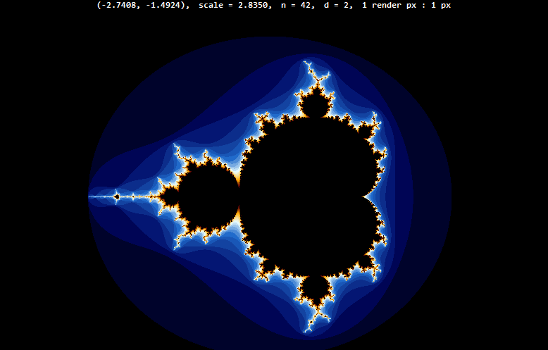
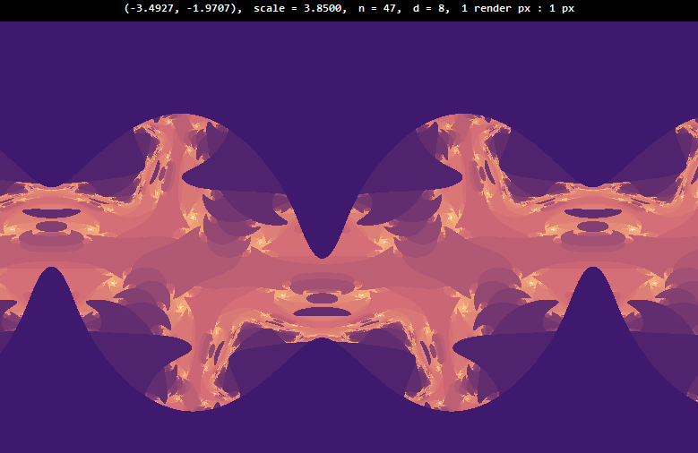
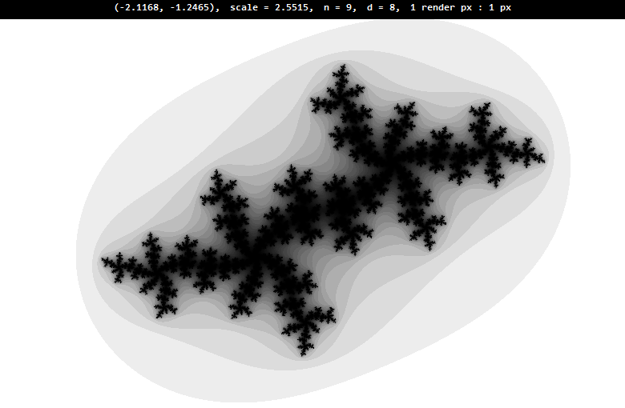
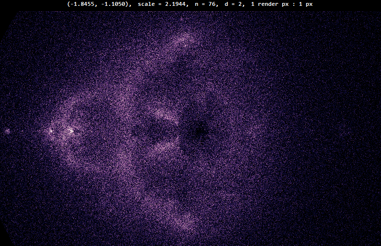

# java-fractals
 
Renders many types of escape time fractals, such as the Mandelbrot set, the Julia set, and the Mandelbox set.
Programmed in Java with swing and awt graphics libraries. 

## Controls
`mousewheel`: Zoom in/out

`click + drag`: Move around the fractal space

`ctrl + mousewheel`: Changes the resolution

`alt + mousewheel`: Changes `d`, the power that `z` is taken to

`shift + mousewheel`: Changes `n`, the amount of iterations

`space`: Renders the Julia sets of the fractal

`1 - 8`: Changes the palette

## Showcase

## Current Fractals
- Mandelbrot
- Tricorn
- Burning Ship
- Buddhabrot
- Newton (z^3 - 1, but code supports more functions)
- Mandelbox (cross sections)

### Original Creations
- Tadpole
  - Appearance of repeating shapes that look like tadpoles
- Chopped Mandelbrot
  - Appearance of mandelbrot without the trailing "tail"
- Duck
  - Appearance of a duck from above. Julia set goes to infinity on the real axis in a wave
- Astronaut
  - For Brandon H. Appearance of "Among Us" characters
- Alfaro
  - Odd values of `d` have alternating long and short gradients