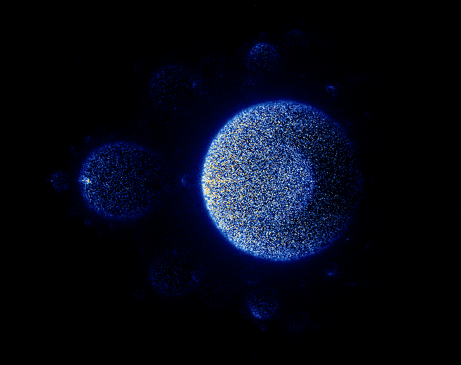
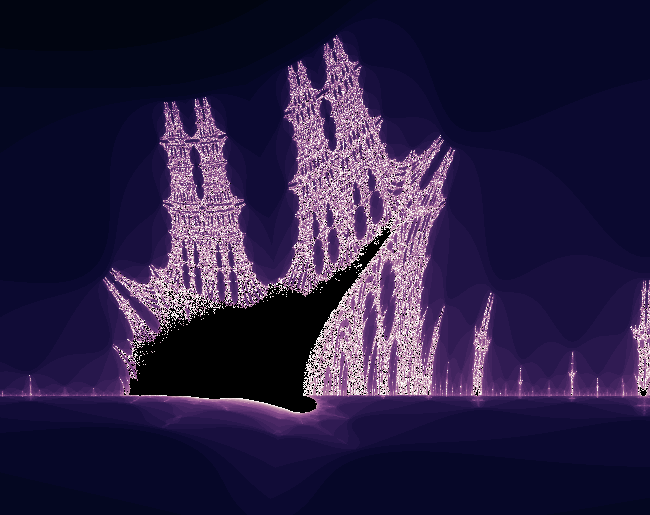

# java-fractals
 
A fractal exploration program with many types of fractals, such as the Mandelbrot set, 
the 3D Sierpinski triangle, and the Newton fractal (full list below).

Features a fully navigable interface with many parameters for custom fractals.

Programmed from entirely scratch in Java, using only Swing and AWT graphics libraries for the interface. 

## Showcase

## Fractal list
The program currently has 12 distinct fractals, but more combinations can
be created by exploring the multibrot and Julia sets of each fractal.
Fractals can be rendered using probabilistic plots of the trajectories of points
that did or did not escape to infinity.

- Mandelbrot
- Tricorn
- Burning Ship
- Newton (z^3 - 1, but code supports more functions)
- Mandelbox (cross-section view)
- Sierpinski Triangle
- Sierpinski Triangle 3D

### Original Creations
- Tadpole
  - Appearance of repeating shapes that look like tadpoles
- Flatworm
  - Appearance of mandelbrot without the trailing "tail"
- Duck
  - Appearance of a duck from above. Julia set goes to infinity on the real axis in a wave
- Astronaut
  - For Brandon H. Appearance of "Among Us" characters
- Alfaro
  - Odd values of `power` have alternating long and short gradients